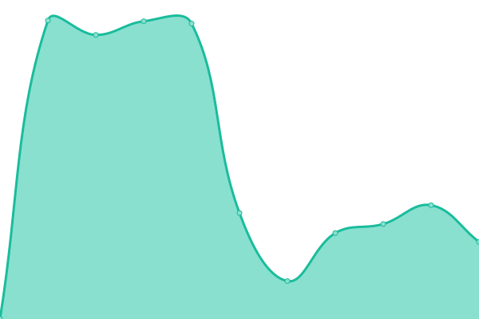
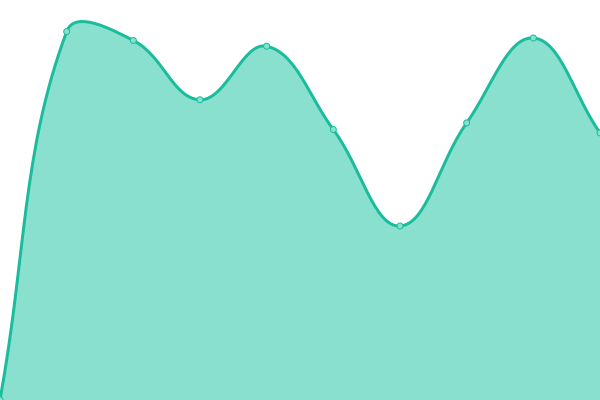

# [📈 Live Status](https://parti-coop.github.io/parti-mx-upptime): <!--live status--> **🟩 All systems operational**

This repository contains the open-source uptime monitor and status page for [Parti co-op 사회적협동조합 빠띠 ](https://parti.coop), powered by [Upptime](https://github.com/upptime/upptime).

With [Upptime](https://upptime.js.org), you can get your own unlimited and free uptime monitor and status page, powered entirely by a GitHub repository. We use [Issues](https://github.com/parti-coop/parti-mx-upptime/issues) as incident reports, [Actions](https://github.com/parti-coop/parti-mx-upptime/actions) as uptime monitors, and [Pages](https://parti-coop.github.io/parti-mx-upptime) for the status page.

<!--start: status pages-->
<!-- This summary is generated by Upptime (https://github.com/upptime/upptime) -->
<!-- Do not edit this manually, your changes will be overwritten -->
<!-- prettier-ignore -->
| URL | Status | History | Response Time | Uptime |
| --- | ------ | ------- | ------------- | ------ |
|  [Parti](https://parti.coop) | 🟩 Up | [parti.yml](https://github.com/parti-coop/parti-mx-upptime/commits/HEAD/history/parti.yml) | 

 1869ms
     
 | 

<a href="https://parti-coop.github.io/parti-mx-upptime/history/parti">100.00%</a>
    

|  [Parti Groups](https://parti.xyz) | 🟩 Up | [parti-groups.yml](https://github.com/parti-coop/parti-mx-upptime/commits/HEAD/history/parti-groups.yml) | 

 901ms
     
 | 

<a href="https://parti-coop.github.io/parti-mx-upptime/history/parti-groups">100.00%</a>
    

|  [Parti Townhall](https://townhall.kr/) | 🟩 Up | [parti-townhall.yml](https://github.com/parti-coop/parti-mx-upptime/commits/HEAD/history/parti-townhall.yml) | 

 1266ms
     
 | 

<a href="https://parti-coop.github.io/parti-mx-upptime/history/parti-townhall">100.00%</a>
    

|  [Parti Mx](https://parti.mx) | 🟩 Up | [parti-mx.yml](https://github.com/parti-coop/parti-mx-upptime/commits/HEAD/history/parti-mx.yml) | 

 1078ms
     
 | 

<a href="https://parti-coop.github.io/parti-mx-upptime/history/parti-mx">100.00%</a>
    

|  [Parti Campaigns](https://campaigns.kr) | 🟩 Up | [parti-campaigns.yml](https://github.com/parti-coop/parti-mx-upptime/commits/HEAD/history/parti-campaigns.yml) | 

 1248ms
     
 | 

<a href="https://parti-coop.github.io/parti-mx-upptime/history/parti-campaigns">100.00%</a>
    

|  [DataPublic](https://datapublic.kr) | 🟩 Up | [data-public.yml](https://github.com/parti-coop/parti-mx-upptime/commits/HEAD/history/data-public.yml) | 

 1579ms
     
 | 

<a href="https://parti-coop.github.io/parti-mx-upptime/history/data-public">100.00%</a>
    

<!--end: status pages-->

[**Visit our status website →**](https://parti-coop.github.io/parti-mx-upptime)

## 📄 License

- Powered by: [Upptime](https://github.com/upptime/upptime)
- Code: [MIT](./LICENSE) © [Parti co-op 사회적협동조합 빠띠 ](https://parti.coop)
- Data in the `./history` directory: [Open Database License](https://opendatacommons.org/licenses/odbl/1-0/)
